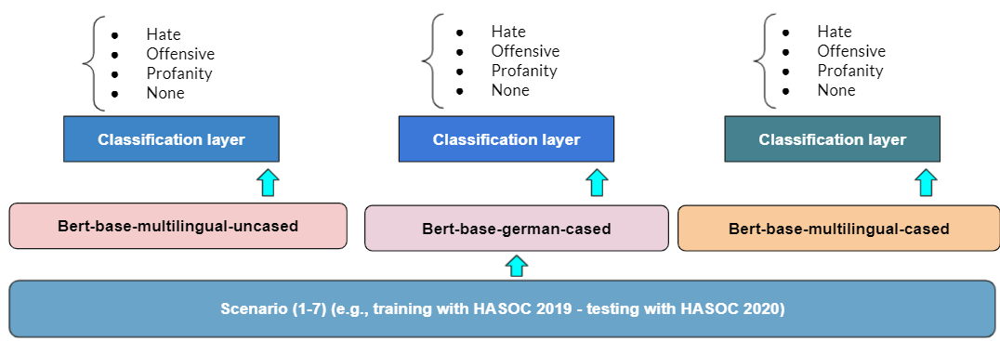

# Tweets-Classification-with-BERT
# Main Objectives and Related Research Questions  
Tweet text classification with BERT, XGBoost and Random Forest.  
Text Categories: Hate, Offensive, Profanity or None. 

Research Questions:  
1. How would attention-based models perform when fine-tuned and tested with different dataset combinations from different time periods?  
2. Is the models' performance independent of the language used ?  
3. Is BERT a better solution than traditional machine learning models for text classification 
 
 

# Datasets  
HASOC 2019  
HASOC 2020    
link to data sources: [HASOC DATASETS MAIN SOURCE](https://hasocfire.github.io/hasoc/2020/dataset.html)

# BERT MDOELS CONSIDERED  
1. [bert-base-multilingual-uncased](https://huggingface.co/bert-base-multilingual-uncased)
2. [bert-base-multilingual-cased](https://huggingface.co/bert-base-multilingual-cased)
3. [bert-base-german-cased](https://huggingface.co/bert-base-german-cased)

# Classification Pipeline  

# RESULTS - DE  

Training | Testing | bert-german-cased | bert-base-multilingual-cased | bert-base-multilingual-uncased |
--- | --- | --- | --- |--- 
HASOC 2019 | HASOC 2019 | 83.7 | 84 | 84 
--- | --- | --- | --- |--- 
HASOC 2020 | HASOC 2020 | 79 | 80.16 | 76.53 
--- | --- | --- | --- |--- 
HASOC 2019 | HASOC 2020 | 73.63 | 71.52 | 71.52 
--- | --- | --- | --- |--- 
HASOC 2020 | HASOC 2019 | 83.05 | 84 | 81.17 
--- | --- | --- | --- |--- 
HASOC 2019 + HASOC 2019 | HASOC 2019 | 96.63 | 84.85 | 86.67 
--- | --- | --- | --- |--- 
HASOC 2019 + HASOC 2020 | HASOC 2019 | 80.44 | 78.77 | 79.6 
--- | --- | --- | --- |--- 
HASOC 2019 + HASOC 2020 | HASOC 2019 + HASOC 2020 | 91 | 82 | 84.31 

# RESULTS - EN  

Training | Testing | bert-base-multilingual-uncased 
--- | --- | ---  
HASOC 2019 | HASOC 2019 | 73.8 
--- | --- | ---  
HASOC 2020 | HASOC 2020 | 81.53
--- | --- | ---  
HASOC 2019 | HASOC 2020 |   76.39
--- | --- | ---  
HASOC 2020 | HASOC 2019 | 75.54
--- | --- | ---  
HASOC 2019 + HASOC 2019 | HASOC 2019 | 79
--- | --- | ---  
HASOC 2019 + HASOC 2020 | HASOC 2019 | 81.1
--- | --- |  ---  
HASOC 2019 + HASOC 2020 | HASOC 2019 + HASOC 2020 |  79.85

# RESULTS - XGBoost and Random Forest Classifiers  

Training | Testing | RF | XGBoost
--- | --- | ---  
HASOC 2019 | HASOC 2019 | 72.16 | 70.51
--- | --- | ---  
HASOC 2020 | HASOC 2020 | 67.6  |  62.85
--- | --- | ---  
HASOC 2019 | HASOC 2020 |   67.6 |  70.39
--- | --- | ---  
HASOC 2020 | HASOC 2019 | 65.83  |  63
--- | --- | ---  
HASOC 2019 + HASOC 2019 | HASOC 2019 | 60.71  | 53
--- | --- | ---  
HASOC 2019 + HASOC 2020 | HASOC 2019 | 48.6  |  49.72
--- | --- |  ---  
HASOC 2019 + HASOC 2020 | HASOC 2019 + HASOC 2020 |  62.74  | 52.45
